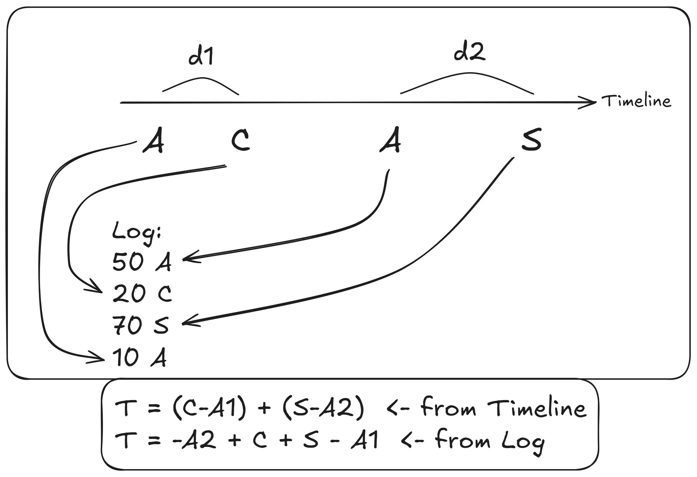

В основе лежит идея о том, что для обработки за $O(N)$ мы должны сразу учитывать любое действие `A/C/S`. `B` не влияет на время, поэтому это действие мы не обрабатываем. Чтобы понять, как сразу учитывать их, рассмотрим такую визуализацию:

Дельта между завершением/отменой поездок и их началом не зависит от порядка, в котором мы учитываем эти действия. Благодаря этому можно идти по циклу записей лога и сразу прибавлять/вычитать их из итогового времени.